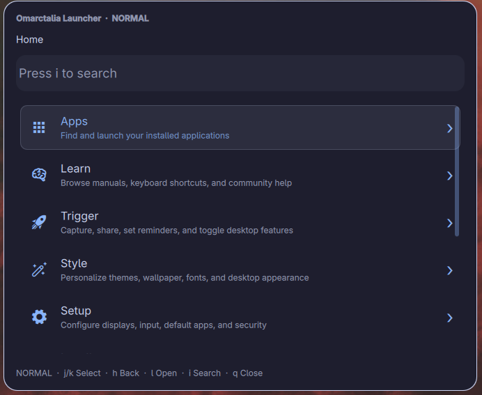
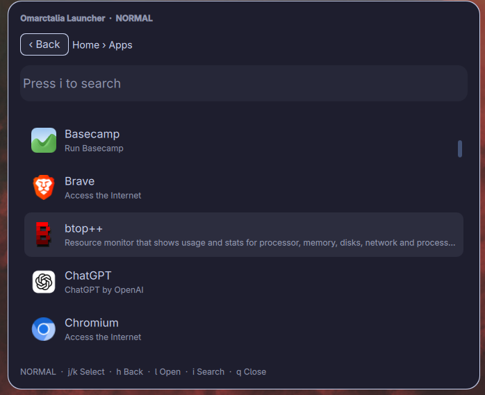

# Omarctalia Launcher

A searchable Omarchy menu and application launcher with optional vi navigation and live theme colors.

Version **1.2.0**. Tested on this machine with the Omarchy **4.0.3-1** package, Quickshell **0.3.1**, and Qt **6.11.2**. Source: https://github.com/DaphnisDuck/omarctalia-launcher.

## Screenshots





## Use

```sh
omarchy-shell shell summon omarctalia.launcher '{}'
```

Home presents Omarchy's categories. Typing searches descendants of the current category, with paths and descriptions in the results. Matching applications appear before menu commands and categories. Application descriptions come from their desktop entries; menu descriptions live in `MenuDescriptions.js`. Existing explicit menu descriptions take precedence.

| Key | Normal mode | Insert mode |
| --- | --- | --- |
| `j` / `k` | Select down / up | Type text |
| `h` / `l` | Back / open selection | Type text |
| `i` or `/` | Start searching | Type text |
| Up / Down | Select a result | Select a result |
| Enter | Open selection | Open selection |
| Alt+Left | Back | Back |
| Backspace | Back | Edit text |
| Escape | Close | Return to normal mode; keep query |
| `q` | Close | Type text |

Clicking an item opens it. Clicking outside closes the launcher. Opening a category returns to normal mode when vi controls are enabled.

To disable vi controls, set this near the top of the **installed** `Launcher.qml`:

```qml
property bool viModeEnabled: false
```

Typing then searches immediately, and Escape closes directly. The installer preserves this setting. Other source edits are backed up but not automatically merged during upgrades.

## Calculator

Press `/` or `i` to search, then type an expression such as `(12 + 8) / 5`, `20% * 150`, or `sqrt(144)`. The answer appears first; Enter or a click copies just the answer and closes the launcher. With vi mode disabled, type directly.

Supports `+`, `-`, `*`, `/`, `^` or `**`, parentheses, unary signs, percentages, scientific notation, `pi`, `e`, `sqrt()` and `abs()`. An optional leading `=` explicitly requests calculation. `%` divides the preceding value by 100: `100 + 20%` is `100.2`; use `100 * 1.2` for a 20% increase. Results display up to 12 significant digits using floating-point arithmetic. Incomplete or invalid expressions cannot be copied as results. Expressions are parsed locally with fixed limits; no JavaScript evaluation or shell execution is used.

## Theme integration

Colors bind to Omarchy's shared `qs.Commons.Color.menu` object. Themes and user `shell.toml` overrides update the card, text, selection, borders, overlay, search field, Back button and scrollbar. App icons retain their own artwork.

## Command security and compatibility

Shared menu files are treated as untrusted data. Their action, condition, and provider strings are compared with a bundled compatibility policy and never evaluated as shell programs. Supported actions use fixed argument lists through a Python broker. Guards use typed package, file, command-presence, and specific system-query operations. Unknown or changed executable fields are hidden; labels, descriptions, icons, and navigation can still be customized.

This changes upstream compatibility: new or changed Omarchy commands require a reviewed policy update. See `SECURITY.md` for the current unsupported entries and execution boundary. The plugin continues to read menu presentation data and application entries live.

External processes start through absolute `/usr/bin` paths. Child processes receive a system-only PATH with shell startup hooks removed. Icon scanning uses bounded Python filesystem traversal without following symlinks. Only validated PNG snapshots beneath configured icon roots reach the image loader; other icons use the existing placeholder. App launching is an explicit user action and uses the selected desktop-entry ID through gtk-launch; installed desktop entries remain executable application definitions.

Menu files are read by an isolated helper, with owner/type checks, no symlink following and a 128 KiB limit per file. Changes are checked every second while open, every ten seconds while closed, and on opening. Malformed or unsafe menus retain the previous working menu. Queries have time and output limits. Icon indexing is cached and preserves its previous results after failure. Unsuccessful selected commands produce a notification. These checks cannot guarantee that an application window appeared or detect every later crash.

## Standard Omarchy installation

Install with Omarchy's plugin manager:

```sh
omarchy plugin add https://github.com/DaphnisDuck/omarctalia-launcher --enable
```

The repository root contains the manifest and runtime files. No build step or custom installer is required for this route. Python 3 is a runtime dependency; Node.js is needed only for tests.

Open the launcher with the command in **Use** above. To bind Super+Space, add this to `~/.config/hypr/bindings.lua`:

```lua
hl.unbind("SUPER + SPACE")
o.bind("SUPER + SPACE", "Omarctalia Launcher", "omarchy-shell shell summon omarctalia.launcher '{}'")
```

This replaces the stock Super+Space menu binding. Save, then run `hyprctl reload` and `hyprctl configerrors`.

Update a standard Git installation with:

```sh
omarchy plugin update omarctalia.launcher
```

Save any local QML edits before updating. The vi-setting preservation described below belongs to the custom installer, not Omarchy's Git updater.

Remove the plugin with:

```sh
omarchy plugin remove omarctalia.launcher
```

Also remove any launcher keybinding you added (including its `hl.unbind` if restoring the default). Removal does not edit your keybindings. Backups made by the custom installer remain in its documented backup directory.

## Local install or upgrade

Requires Python 3.9+, Quickshell, coreutils `timeout`, `uwsm-app`, `gtk-launch`, `notify-send`, `pacman`, and the installed Omarchy commands and theme interface. Executables must be available under `/usr/bin`. Testing also needs Node.js and QtTest.

From this source folder:

```sh
python3 install.py --check
python3 tests/run.py
python3 install.py
```

Default destination: `~/.config/omarchy/plugins/omarctalia.launcher/`.

The installer copies only runtime files, preserves the vi switch, publishes complete files by descriptor-relative rename, fsyncs files and directories, and verifies their contents. Installation and backup paths must contain no symlinks. Existing files are bounded to 2 MiB and must be regular, single-link files owned by the current user, without group/world write access. Existing unrelated files are left alone. Backups are stored outside the watched plugin folder at `${XDG_STATE_HOME:-~/.local/state}/omarctalia-launcher/backups/`. An installation failure triggers rollback.

For a new installation, enable the plugin through Omarchy's plugin menu. Existing enabled installations reload their saved code automatically. If necessary, run `omarchy-shell shell rescanPlugins`.

## Roll back

The installer prints the exact snapshot directory. Restore it from this source folder:

```sh
python3 install.py --restore /absolute/path/to/snapshot
```

Restore validates the backup and refuses to overwrite files edited after the installation. Save those edits before using `--force`. Legacy timestamped backups from earlier development remain in the installed folder.

## Tests and maintenance

`python3 tests/run.py` checks model parsing, menu recovery, rejection of untrusted executable fields, typed action dispatch, poisoned PATH/startup hooks, icons and caching, UI navigation/search, vi modes, theme changes, and installation/rollback. External action dispatch is mocked in UI tests; no real applications or menu actions are launched. Guard checks may perform read-only system queries.

Live Wayland focus, multiple displays, suspend/resume, and login-session behavior still need normal desktop use. Keep the stock Omarchy menu reachable, and rerun the suite after major Omarchy/Quickshell upgrades. The dependency check catches missing interfaces; it is not a guarantee of compatibility with future releases.

## Source layout

- `Launcher.qml`: UI, keyboard handling and dispatch.
- `MenuCatalog.qml`: menu files, app catalog and dynamic providers.
- `MenuModel.js`: bundled parser/model with local fixes.
- `MenuDescriptions.js`: editable menu descriptions.
- `IconResolver.qml`: icon lookup and cached fallback.
- `command-broker.py`: typed guards, providers, icon enumeration and selected action dispatch.
- `CommandPolicy.json` / `CommandPolicy.js`: reviewed command compatibility snapshot.
- `install.py` and `tests/`: repeatable installation, rollback and validation.

See `UPSTREAM.md` and `LICENSE-OMARCHY` for the Omarchy-derived code's provenance and license.

## License

Original Omarctalia code is available under the MIT license in `LICENSE`. Omarchy-derived code retains its upstream MIT notice in `LICENSE-OMARCHY`; see `UPSTREAM.md`. Application icons are loaded from the user’s installed system and are not bundled in this repository.
